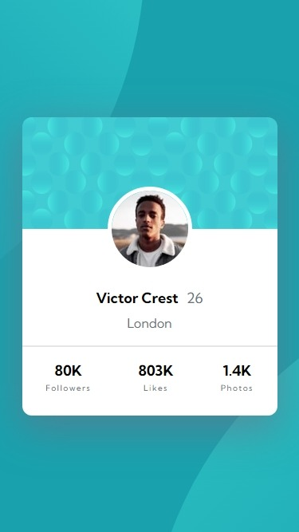
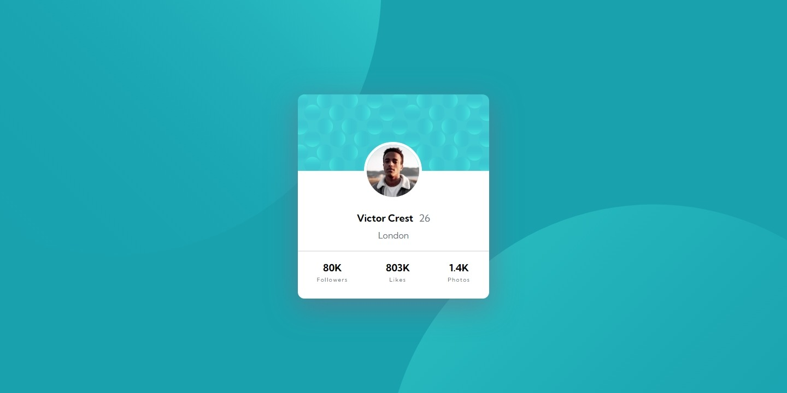

# Frontend Mentor - Profile card component solution

This is a solution to the [Profile card component challenge on Frontend Mentor](https://www.frontendmentor.io/challenges/profile-card-component-cfArpWshJ). Frontend Mentor challenges help you improve your coding skills by building realistic projects.

## Table of contents

- [Overview](#overview)
  - [The challenge](#the-challenge)
  - [Screenshot](#screenshot)
  - [Links](#links)
- [My process](#my-process)
  - [Built with](#built-with)
  - [What I learned](#what-i-learned)
  - [Continued development](#continued-development)
  - [Useful resources](#useful-resources)
- [Author](#author)
- [Acknowledgments](#acknowledgments)

### The challenge

- Build out the project to the designs provided

### Screenshot




### Links

- Solution URL: [Solution on GitHub](https://github.com/horoserp/profile-card)
- Live Site URL: [Live Site](https://horoserp.github.io/profile-card)

## My process

### Built with

- Semantic HTML5 markup
- CSS custom properties
- Flexbox

### What I learned

This project helped me learn more about background-images and background-position. Additionally, I feel like this challenge helped me improve my use of box-shadows.

```css
body {
  font-family: "Main";
  background-color: var(--Dark-cyan);
  background-image: url("./assets/images/bg-pattern-top.svg"),
    url("./assets/images/bg-pattern-bottom.svg");
  background-position: right 51.5vw bottom 35vh, left 49vw top 52vh;
  background-repeat: no-repeat, no-repeat;
}
```

### Continued development

I would like to continue learning more about Semantic HTML and Accessibility.

### Useful resources

- [W3Schools](https://www.w3schools.com/) - This is a great reference site which helped me remember some of the required syntax.
- [Stack Overflow](https://stackoverflow.com/) - This is an excellent resource for finding answers to precise questions.

## Author

- Website - [Robert P. Horosewski](https://horoserp.github.io/React-Portfolio)
- Frontend Mentor - [@horoserp](https://www.frontendmentor.io/profile/horoserp)
- LinkedIn - [Robert P. Horosewski](https://www.linkedin.com/in/robert-horosewski-8a0608196/)

## Acknowledgments

Thanks to my wife for the encouragement to pursue my dream.
